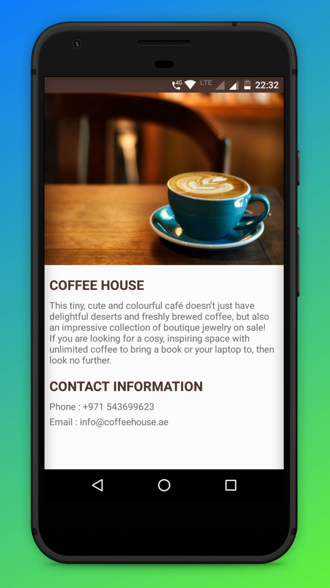

# Single-Screen-App
Android Basics by Google Nanodegree Program - Udacity

## Project Overview
Design and implement a single screen app that displays information about a fictional coffee shop.

## Screenshot

